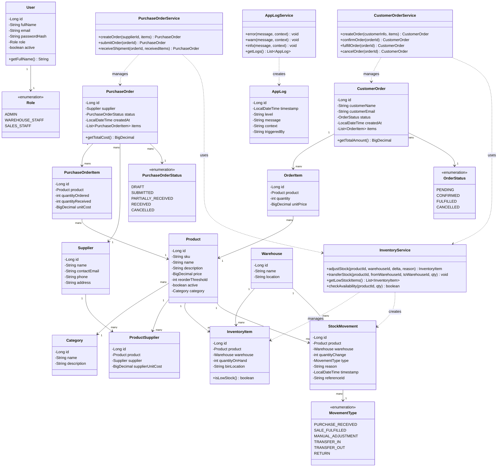

# Class Diagram (Java Problem-Domain Layer)

This reflects the core `model` package — the domain entities and how they relate.
Services (`ProductService`, `InventoryService`, `PurchaseOrderService`,
`CustomerOrderService`, `UserService`) sit on top of these and contain the business
rules described in the functional requirements.

**Key design decisions:**
- `InventoryItem` and `StockMovement` are deliberately separate: `InventoryItem` is
  the current snapshot (fast to query), `StockMovement` is the append-only audit log
  (never updated, only inserted).
- `InventoryService` is the single choke point through which all quantity changes must
  flow — `PurchaseOrderService` and `CustomerOrderService` both delegate to it rather
  than touching `InventoryItem` directly. This enforces FR13.
