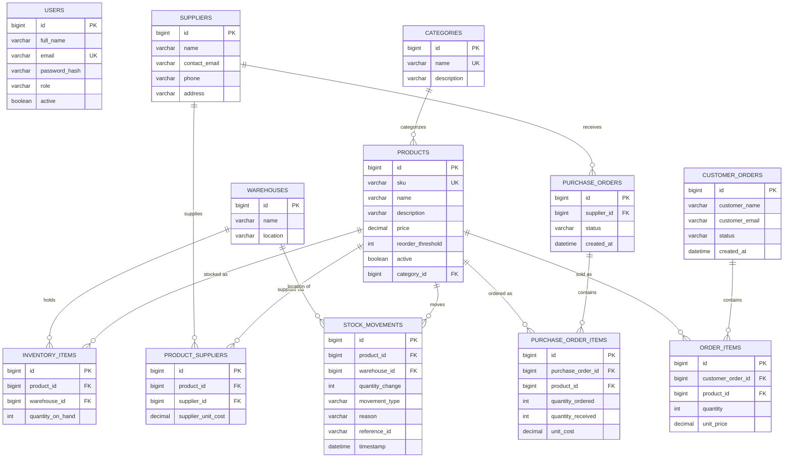

# Database Diagram (MySQL)

## Notes on Constraints
- `PRODUCTS.sku` and `CATEGORIES.name` are `UNIQUE`.
- `INVENTORY_ITEMS` has a composite unique constraint on `(product_id, warehouse_id)` —
  one row per product per warehouse.
- `STOCK_MOVEMENTS` is append-only (no UPDATE/DELETE in application code) — it's the
  audit trail; `reference_id` links back to the purchase order / customer order that
  triggered it, when applicable.
- All `FK` columns use `ON DELETE RESTRICT` except where a parent is meant to soft-delete
  (products/suppliers use an `active` flag rather than hard deletes, per FR8).
- See `backend/src/main/resources/schema.sql` for the literal DDL, and the JPA
  `@Entity` classes in `backend/.../model` for how Spring Data derives this schema.
